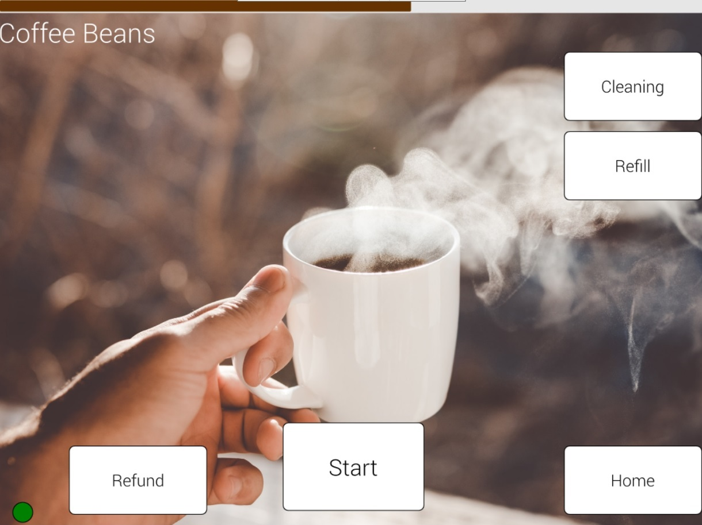

# Coffeeberry 

## PyQt 5 & QtQuick 2 

 - buy coffe using RFID
 - get paid for cleaning and refilling beans

## Ui Design 

{ width=100% }

physical devices

 - MFRC522 RFID Transmitter
 - HC-SR04 Ultrasonic Sensor
 - 16 Bit ADS for checking status LED
 - relays to switch start button

{ width=100% }

